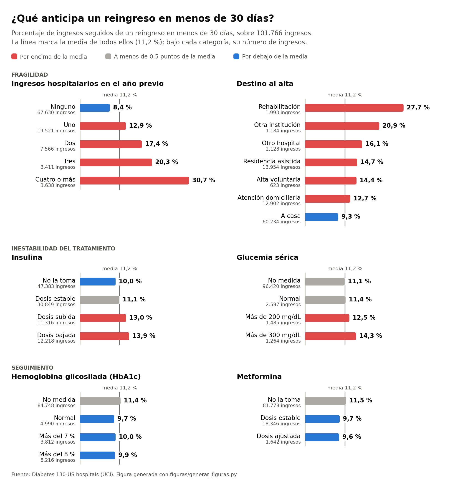
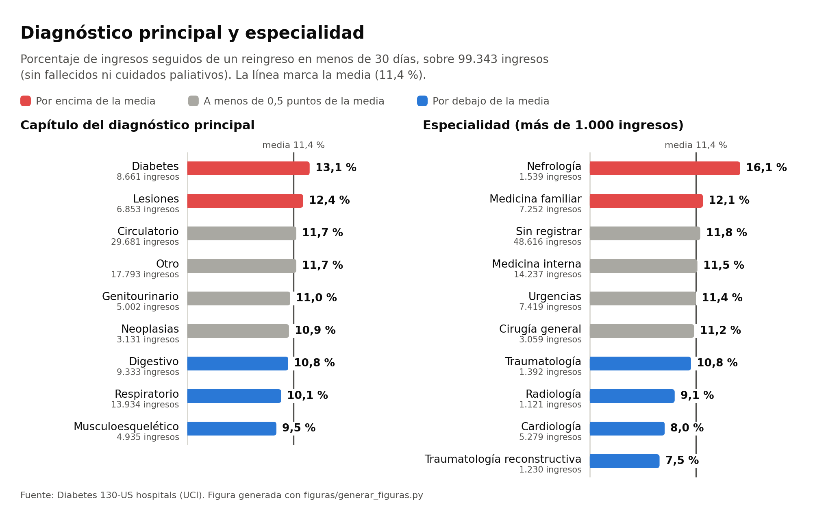
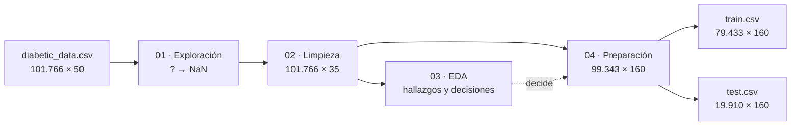

# Readmisión hospitalaria en pacientes diabéticos


Limpieza, análisis exploratorio y preparación de **101.766 ingresos hospitalarios de pacientes
diabéticos** (130 hospitales de EE. UU., 1999-2008) para predecir quién **reingresa en menos de 30
días**. El proyecto termina con los conjuntos `train` y `test` listos para modelar; el modelado es un
proyecto aparte.

La readmisión en menos de 30 días es un indicador habitual de calidad asistencial y, en EE. UU., motivo
de penalizaciones económicas a los hospitales
([Hospital Readmissions Reduction Program](https://www.cms.gov/medicare/quality/value-based-programs/hospital-readmissions)).
Identificar al alta a los pacientes con más riesgo permite reforzar su seguimiento.

| **101.766** | **71.518** | **11,16 %** | **2.423** | **158** |
|:---:|:---:|:---:|:---:|:---:|
| ingresos | pacientes | reingresan en menos de 30 días | ingresos excluidos (fallecidos y cuidados paliativos) | variables predictoras preparadas |

## Resultados

<picture>
  <source media="(prefers-color-scheme: dark)" srcset="figuras/factores_oscuro.png">
  
</picture>

Tres factores se asocian a un reingreso en menos de 30 días (notebook 03):

- **Fragilidad.** El riesgo crece con los ingresos del año anterior —del 8,4 % sin ninguno al 30,7 % con
  cuatro o más— y con la dependencia al alta: 9,3 % tras volver a casa, 27,7 % tras un traslado a
  rehabilitación.
- **Inestabilidad del tratamiento.** Un ajuste de la insulina, al alza o a la baja (13-14 %, frente al
  10,0 % de quien no la toma), o una glucemia sérica por encima de 300 mg/dL (14,3 %).
- **Seguimiento**, en sentido contrario. Medir la HbA1c (~10 %, frente al 11,4 % sin medir) y una
  metformina estable (9,7 %, frente al 11,5 % sin ella) se asocian a menos reingreso.

`gender` y `race` no discriminan, y tres fármacos no tienen casos suficientes para evaluarse. **La señal
es real pero modesta**: ninguna variable separa las clases por sí sola, y un modelo tendrá que
combinarlas.

<details>
<summary>Cifras de la figura</summary>

| Factor | Categoría | Ingresos | Reingreso en menos de 30 días |
|---|---|---:|---:|
| Ingresos hospitalarios en el año previo | Ninguno | 67.630 | 8,44 % |
|  | Uno | 19.521 | 12,92 % |
|  | Dos | 7.566 | 17,43 % |
|  | Tres | 3.411 | 20,29 % |
|  | Cuatro o más | 3.638 | 30,70 % |
| Destino al alta | Rehabilitación | 1.993 | 27,70 % |
|  | Otra institución | 1.184 | 20,86 % |
|  | Otro hospital | 2.128 | 16,07 % |
|  | Residencia asistida | 13.954 | 14,66 % |
|  | Alta voluntaria | 623 | 14,45 % |
|  | Atención domiciliaria | 12.902 | 12,70 % |
|  | A casa | 60.234 | 9,30 % |
| Insulina | No la toma | 47.383 | 10,04 % |
|  | Dosis estable | 30.849 | 11,13 % |
|  | Dosis subida | 11.316 | 12,99 % |
|  | Dosis bajada | 12.218 | 13,90 % |
| Glucemia sérica | No medida | 96.420 | 11,09 % |
|  | Normal | 2.597 | 11,36 % |
|  | Más de 200 mg/dL | 1.485 | 12,46 % |
|  | Más de 300 mg/dL | 1.264 | 14,32 % |
| Hemoglobina glicosilada (HbA1c) | No medida | 84.748 | 11,42 % |
|  | Normal | 4.990 | 9,66 % |
|  | Más del 7 % | 3.812 | 10,05 % |
|  | Más del 8 % | 8.216 | 9,87 % |
| Metformina | No la toma | 81.778 | 11,52 % |
|  | Dosis estable | 18.346 | 9,71 % |
|  | Dosis ajustada | 1.642 | 9,56 % |
| **Media** | | | **11,16 %** |

</details>

### Diagnóstico y especialidad

<picture>
  <source media="(prefers-color-scheme: dark)" srcset="figuras/diagnostico_especialidad_oscuro.png">
  
</picture>

Ya agrupados (notebook 04), el diagnóstico y la especialidad también discriminan. La diabetes como
motivo del ingreso eleva el reingreso al 13,1 %, y las neoplasias como diagnóstico secundario, al 16,2 %
y al 15,5 %. Por especialidad, la tasa va del 7,5 % de traumatología reconstructiva y el 8,0 % de
cardiología al 16,1 % de nefrología. El 49 % de ingresos sin especialidad registrada no se aparta de la
media (11,8 %).

<details>
<summary>Cifras de la figura</summary>

| Factor | Categoría | Ingresos | Reingreso en menos de 30 días |
|---|---|---:|---:|
| Capítulo del diagnóstico principal | Diabetes | 8.661 | 13,10 % |
|  | Lesiones | 6.853 | 12,40 % |
|  | Circulatorio | 29.681 | 11,69 % |
|  | Otro | 17.793 | 11,68 % |
|  | Genitourinario | 5.002 | 11,04 % |
|  | Neoplasias | 3.131 | 10,89 % |
|  | Digestivo | 9.333 | 10,82 % |
|  | Respiratorio | 13.934 | 10,06 % |
|  | Musculoesquelético | 4.935 | 9,54 % |
| Especialidad (más de 1.000 ingresos) | Nefrología | 1.539 | 16,11 % |
|  | Medicina familiar | 7.252 | 12,12 % |
|  | Sin registrar | 48.616 | 11,83 % |
|  | Medicina interna | 14.237 | 11,53 % |
|  | Urgencias | 7.419 | 11,39 % |
|  | Cirugía general | 3.059 | 11,18 % |
|  | Traumatología | 1.392 | 10,85 % |
|  | Radiología | 1.121 | 9,10 % |
|  | Cardiología | 5.279 | 8,03 % |
|  | Traumatología reconstructiva | 1.230 | 7,48 % |
| **Media** | | | **11,39 %** |

</details>

### Otros hallazgos

- **`>30` no es un punto intermedio.** En historial previo se parece a `<30` (42,80 % con algún ingreso
  previo, frente al 49,71 %); en destino al alta, a `NO` (60,61 % dados de alta a casa, frente al
  63,04 %). Es el paciente crónico que vuelve, pero cuyo alta no fue problemática.
- **La diabetes rara vez es el motivo del ingreso**: es el 8,72 % de los diagnósticos principales y el
  17,09 % de los terciarios.
- **Los pacientes que vuelven concentran el riesgo**: los que tienen varios ingresos reingresan antes de
  30 días en el 19,76 % de ellos, frente al 4,26 % de los que tienen uno solo. Es el motivo de partir por
  paciente.
- **Excluir a los fallecidos no explica el `NO` elevado de los mayores de 90 años**: corrige un punto de
  los ocho de desvío. El resto queda sin explicar; entre las hipótesis, muertes posteriores al alta que
  el dataset no registra.

## Cómo se ha hecho

### Flujo de datos



<details>
<summary>Paso a paso</summary>

| Paso | Notebook | Filas × columnas |
|---|---|---|
| Dataset original | — | 101.766 × 50 |
| `?` y `Unknown/Invalid` a `NaN` | 01 | 101.766 × 50 |
| Limpieza: 15 columnas eliminadas, ausencias como categoría | 02 | 101.766 × 35 |
| Recuperación de `patient_nbr` | 04 (apartado 1) | 101.766 × 36 |
| Exclusión de fallecidos y cuidados paliativos | 04 (apartado 2) | 99.343 × 36 |
| Agrupación de categorías | 04 (apartado 3) | 99.343 × 36 |
| Eliminación de 5 variables sin señal | 04 (apartado 4) | 99.343 × 31 |
| Objetivo binario `readmitted_30d` | 04 (apartado 5) | 99.343 × 31 |
| Codificación | 04 (apartado 6) | 99.343 × 160 |
| Partición por paciente | 04 (apartado 7) | 79.433 + 19.910 × 160 |

El notebook 03 no transforma datos: sus conclusiones deciden los pasos del 04.

</details>

### Decisiones

- **Ausencias como categoría propia** (`Unknown`, `Not_Measured`): en `A1Cresult` y `max_glu_serum`, la
  ausencia significa "prueba no realizada". Solo se imputa la moda en `gender` (3 registros).
- **Valores extremos conservados**: un historial de ingresos alto es un paciente real de alto riesgo,
  no un error.
- **Exclusión de 2.423 ingresos de fallecidos y cuidados paliativos**: su `NO` es una imposibilidad, no
  una evolución.
- **Agrupación de categorías**: diagnósticos en 10 capítulos CIE-9 (esquema de Strack et al., 2014) y
  categorías con menos de 100 ingresos en `Otros`. En las ocho variables afectadas, de 2.390 categorías
  a 107.
- **Objetivo binario `readmitted_30d`**: reingreso en menos de 30 días frente al resto.
- **Codificación**: binarias a 0/1, `age` por el punto medio del tramo y 18 nominales con *one-hot*. Las
  numéricas no se escalan: el escalado se ajusta sobre `train` en el modelado.
- **Partición 80/20 por paciente** (`random_state=42`): ningún paciente en los dos conjuntos. Una
  partición por filas habría dejado 6.800 pacientes en ambos lados, y el 41,67 % de los ingresos de
  `test` sería de pacientes ya vistos en `train`.

### Estructura del repositorio

| Notebook | Contenido | Salida |
|---|---|---|
| [`01_exploracion_inicial`](notebooks/01_exploracion_inicial.ipynb) | Estructura, valores desconocidos (`?` → `NaN`), naturaleza de cada variable y rangos | `diabetic_data_replaceNaN.csv` (101.766 × 50) |
| [`02_limpieza_dataset`](notebooks/02_limpieza_dataset.ipynb) | 15 columnas eliminadas, ausencias como categoría propia y tipos | `diabetic_data_clean.csv` (101.766 × 35) |
| [`03_EDA`](notebooks/03_EDA.ipynb) | Variable objetivo, numéricas y categóricas frente a `readmitted`, correlaciones y redundancias | Tabla final de variables (apartado 6.3) |
| [`04_preparacion`](notebooks/04_preparacion.ipynb) | Exclusiones, agrupación de categorías, objetivo binario, codificación y partición por paciente | `train.csv` (79.433 × 160) y `test.csv` (19.910 × 160) |

```
readmision_diabetes_eda/
├── data/
│   ├── raw/          diabetic_data.csv (original) · IDS_mapping.csv (significado de los códigos)
│   └── processed/    train.csv · test.csv
├── notebooks/        01 → 02 → 03 → 04
├── figuras/          generar_figuras.py y las figuras de este README
├── requirements.txt
└── LICENSE
```

## Datos preparados

| | `train.csv` | `test.csv` |
|---|---|---|
| Ingresos | 79.433 | 19.910 |
| Pacientes | 55.992 | 13.998 |
| Readmitidos en menos de 30 días | 11,42 % | 11,27 % |

Las 160 columnas son enteras:

| Bloque | Columnas |
|---|---|
| `patient_nbr` (identificador; no es predictora) | 1 |
| `readmitted_30d` (objetivo) | 1 |
| Numéricas originales | 8 |
| Binarias (`change`, `diabetesMed`) y `age` | 3 |
| *One-hot* de las 18 nominales | 147 |
| **Total** | **160** |

```python
import pandas as pd

train = pd.read_csv('data/processed/train.csv')
X = train.drop(columns=['patient_nbr', 'readmitted_30d'])   # 158 predictoras
y = train['readmitted_30d']                                  # 1 = reingreso en menos de 30 días
grupos = train['patient_nbr']                                # para validar agrupando por paciente
```

`test.csv` se reserva para la evaluación final. Los archivos están en UTF-8: algunos nombres de columna
llevan `>`, `/` o tildes.

## Limitaciones

- El dataset parece registrar solo los reingresos dentro de la misma red hospitalaria y no recoge los
  fallecimientos posteriores al alta: parte de los `0` pueden no serlo.
- Algunos códigos de dato ausente (`admission_type_id` = `NULL`, `payer_code` = `Unknown`) parecen
  reflejar el origen del registro más que al paciente.
- El umbral de 100 ingresos para agrupar categorías se calculó sobre todo el dataset, no solo sobre
  `train`.

## Reproducción

Requiere Python 3.13 y las versiones de `requirements.txt`:

```bash
pip install -r requirements.txt
```

Los notebooks se ejecutan en orden (01 → 02 → 03 → 04) desde la carpeta `notebooks/`; las rutas son
relativas. Los CSV intermedios se regeneran al ejecutar el 01 y el 02, y el 04 vuelve a escribir
`train.csv` y `test.csv`. Las figuras de este README se regeneran con `python figuras/generar_figuras.py`.

## Referencias

- Clore, J., Cios, K., DeShazo, J. y Strack, B. (2014). *Diabetes 130-US Hospitals for Years 1999-2008*
  [dataset]. UCI Machine Learning Repository. https://doi.org/10.24432/C5230J
- Strack, B., DeShazo, J. P., Gennings, C., Olmo, J. L., Ventura, S., Cios, K. J. y Clore, J. N. (2014).
  Impact of HbA1c measurement on hospital readmission rates: analysis of 70,000 clinical database
  patient records. *BioMed Research International*, 2014, 781670. https://doi.org/10.1155/2014/781670

---

**Autor:** Diego Rodríguez Díaz del Campo · Código bajo licencia [MIT](LICENSE); datos bajo CC BY 4.0.
